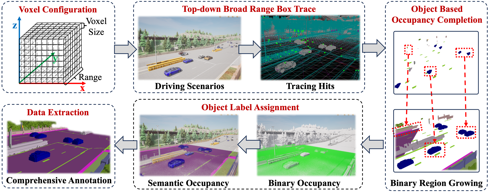

# 
 Co3SOP: A Collaborative 3D Semantic Occupancy Prediction Dataset and Benchmark for Autonomous Driving

## News
- [2025/03/10] The annotations for 3D semantic occupancy prediction are uploaded [here](https://huggingface.co/datasets/WuHanlin1997/Co3SOP/tree/main).

## Table of Contents
- [Introduction](#introduction)
- [Getting Start](#getting-start)
- [Benchmark Result](#benchmark-result)
- [Acknowledgements](#acknowledgements)

## Introduction
To facilitate 3D semantic occupancy prediction in collaborative scenarios, we present a simulated dataset featuring a 3D semantic occupancy voxel sensor in Carla, which precisely and comprehensively annotate every surrounding voxel with semantic and occupancy states. In addition, we establish two benchmarks with varying detection ranges to investigate the impact of vehicle collaboration across different spatial extents and propose a baseline model that allows collaborative feature fusion. Experiments on our proposed benchmark demonstrate the superior performance of our baseline model.

## Getting Start

[Dataset Preparation](Docs/DatasetPreparation.md)

[Installation](Docs/Installation.md)

[Baseline Training and Evaluation](Docs/Baseline.md)

[Customized Annotation Collection](Docs/AnnotationCollection.md) (Optional)

## Benchmark Result 

**<big> 1. Benchmark Result for Range [25.6, 25.6, 4.8]m**

| Methodology | Modality | mIoU | Empty | Buildings | Fences | Other | Pedestrians | Poles | Roadlines | Roads | Sidewalks | Vegetation | Vehicles | Walls | Trafficsigns | Sky | Ground | Bridge | Railtrack | Guardrail | Trafficlight | Static | Dynamic | Water | Terrain | Unlabeled |
|----------|----------|----------|----------|----------|----------|----------|----------|----------|----------|----------|----------|----------|----------|----------|----------|----------|----------|----------|----------|----------|----------|----------|----------|----------|----------|----------|
| SSCNet  | Lidar   |  13.21 | 93.01 | 1.84 | 0.16 | 0.00 | 0.00 | 3.60 | 0.00 | 0.23 | 19.22 | 41.43 | 71.73 | 0.26 | 0.00 | 0.00 | 37.73 | 0.00 | 0.00 | 8.22 | 0.25 | 3.68 | 0.07 | 0.00 | 26.41 | 9.26 |
| LMSCNet | Lidar | 24.92 | 96.90 | 8.67 | 22.27 | 0.00 | 0.00 | 29.57 | 2.57 | 86.70 | 42.24 | 43.77 | 85.35 | 9.97 | 18.19 | 0.00 | 62.68 | 0.00 | 0.00 | 12.02 | 0.00 | 18.39 | 1.57 | 0.00 | 36.11 | 21.16 |
| OccFormer  | Camera  | 29.48 | 97.03 | 11.63 |14.17 | 0.00 | 0.00 | 19.67 |39.64 | 87.40 | 45.32 | 42.78 | 75.7 | 13.41 | 9.73 | 0.00 | 67.08 | 0.00 | 0.00 | 35.53 | 5.43 | 16.14 | 1.82 | 0.00 | 86.95 | 38.01 |
| SurroundOcc  | Camera  |  28.71 | 97.33 | 10.63 | 11.06 | 0.00 | 0.00 | 17.22 | 26.78 | 86.87 | 46.61 | 44.92 | 75.95 | 12.37 | 17.27 | 0.00 | 53.80 | 0.00 | 0.00 | 48.49 | 2.11 | 12.86 | 2.89 | 0.00 | 76.58 | 45.44 |
| Co3SOP-Ego |Camera|29.36|97.30|9.96|12.56|0.01|0.00|18.73|36.19|88.53|44.69|45.51|77.53|11.13|11.10|0.00|55.08|0.00|0.00|48.61|1.50|14.61|4.03|0.00|82.49|45.26|
| Co3SOP-Base |Camera|30.04|97.41|10.05|12.37|0.00|0.00|20.02|38.43|89.24|46.12|46.36|80.55|12.11|11.16|0.00|55.84|0.00|0.00|53.23|1.27|14.71|3.68|0.00|82.93|45.53|

**2. Benchmark Result for Range [51.2, 51.2, 4.8]m**

| Methodology | Modality | mIoU | Empty | Buildings | Fences | Other | Pedestrians | Poles | Roadlines | Roads | Sidewalks | Vegetation | Vehicles | Walls | Trafficsigns | Sky | Ground | Bridge | Railtrack | Guardrail | Trafficlight | Static | Dynamic | Water | Terrain | Unlabeled |
|----------|----------|----------|----------|----------|----------|----------|----------|----------|----------|----------|----------|----------|----------|----------|----------|----------|----------|----------|----------|----------|----------|----------|----------|----------|----------|----------|
| SSCNet  | Lidar   |  9.58 | 91.18 | 0.17 | 1.48 | 0.00 | 0.00 | 0.14 | 0.16 | 25.88 | 9.57 | 30.89 | 48.09 | 0.49 | 0.00 | 0.00 | 0.08 | 0.03 | 0.00 | 12.72 | 0.00 | 0.94 | 3.09 | 0.00 | 2.74 | 2.31 |
| LMSCNet | Lidar | 20.35 | 95.79 | 3.09 | 18.01 | 0.00 | 0.00 | 24.95 | 0.57 | 75.84 | 48.66 | 34.90 | 75.63 | 10.39 | 0.02 | 0.00 | 31.81 | 0.00 | 0.00 | 6.07 | 0.00 | 4.37 | 0.04 | 0.00 | 36.93 | 21.47 |
| OccFormer  | Camera  |  25.41 | 95.04 | 11.93 | 12.57 | 0.35 | 0.00 | 12.62 | 22.10 | 75.30 | 51.41 | 39.77 | 51.26 | 15.53 | 7.68 | 0.00 | 57.79 | 2.95 | 0.00 | 41.41 | 3.75 | 11.61 | 7.10 | 0.00 | 53.91 | 35.83 |
| SurroundOcc  | Camera  |  25.76 | 95.33 | 7.57 | 11.60 | 1.77 | 0.00 | 13.51 | 22.13 | 79.53 | 45.23 | 35.60 | 52.34 | 12.92 | 11.72 | 0.00 | 52.90 | 2.32 | 0.00 | 42.17 | 2.03 | 10.08 | 6.46 | 0.00 | 75.08 | 37.88 |
| Co3SOP-Ego|Camera|25.85|95.21|7.52|13.18|1.36|0.00|10.91|24.78|78.95|43.38|35.72|54.02|13.13|10.35|0.00|54.45|2.17|0.00|38.22|3.25|11.70|8.45|0.00|75.21|38.53|
| Co3SOP-Base|Camera|27.32|95.37|8.71|14.53|0.09|0.00|15.11|28.56|79.05|44.51|37.00|64.42|13.20|9.89|0.00|55.63|2.36|0.00|51.47|2.45|11.74|6.99|0.00|77.46|37.18|

**3. Benchmark Result for Range [76.8, 76.8, 4.8]m**

| Methodology | Modality | mIoU | Empty | Buildings | Fences | Other | Pedestrians | Poles | Roadlines | Roads | Sidewalks | Vegetation | Vehicles | Walls | Trafficsigns | Sky | Ground | Bridge | Railtrack | Guardrail | Trafficlight | Static | Dynamic | Water | Terrain | Unlabeled |
|----------|----------|----------|----------|----------|----------|----------|----------|----------|----------|----------|----------|----------|----------|----------|----------|----------|----------|----------|----------|----------|----------|----------|----------|----------|----------|----------|
| SSCNet  | Lidar   |  10.04 | 87.33 | 0.19 | 0.41 | 16.18 | 0.00 | 0.00 | 0.00 | 0.14 | 20.28 | 22.91 | 39.35 | 0.18 | 0.00 | 0.00 | 22.18 | 0.07 | 0.00 | 10.21 | 0.00 | 3.40 | 0.62 | 0.00 | 17.01 | 0.53 |
| LMSCNet | Lidar | 17.62 | 93.70 | 1.79 | 9.26 | 0.00 | 0.00 | 17.92 | 0.00 | 67.99 | 53.27 | 23.91 | 62.94 | 10.08 | 0.04 | 0.00 | 20.59 | 0.00 | 0.00 | 3.37 | 0.00 | 2.82 | 0.00 | 0.00 | 33.43 | 21.72 |
| OccFormer  | Camera  |  24.12 | 92.67 | 13.43 | 11.04 | 2.74 | 0.00 | 10.17 | 15.53 | 73.69 | 59.51 | 35.30 | 33.35 | 11.55 | 2.49 | 0.00 | 64.75 | 5.45 | 0.00 | 36.90 | 0.11 | 13.44 | 9.11 | 0.00 | 53.05 | 34.63 |
| SurroundOcc  | Camera  |  24.68 | 93.61 | 6.91 | 8.84 | 12.50 | 0.00 | 4.78 | 14.09 | 74.87 | 55.30 | 29.08 | 29.20 | 10.03 | 6.23 | 0.00 | 64.77 | 3.74 | 0.00 | 39.65 |1.10 | 10.22 | 8.33 | 0.00 | 75.08 | 44.03 |
| Co3SOP-Ego|Camera|24.81|93.46|7.32|9.88|12.04|0.00|4.29|14.55|75.54|53.53|31.18|34.32|10.54|7.41|0.00|62.58|4.02|0.00|40.02|2.18|11.18|8.80|0.00|71.54|41.13|
| Co3SOP-Base|Camera|27.00|93.78|9.15|11.38|6.83|0.00|7.12|16.08|80.28|55.47|34.26|50.98|12.70|10.02|0.00|68.88|4.39|0.00|44.89|2.42|13.16|9.48|0.00|74.43|42.44|

## Acknowledgements
Many thanks to these excellent projects:
- [OpenCOOD](https://github.com/DerrickXuNu/OpenCOOD)
- [SurroundOcc](https://github.com/weiyithu/SurroundOcc)
- [CoHFF](https://github.com/rruisong/CoHFF)
- [LMSCNet](https://github.com/astra-vision/LMSCNet)
- [OccFormer](https://github.com/DerrickXuNu/OpenCOOD)
